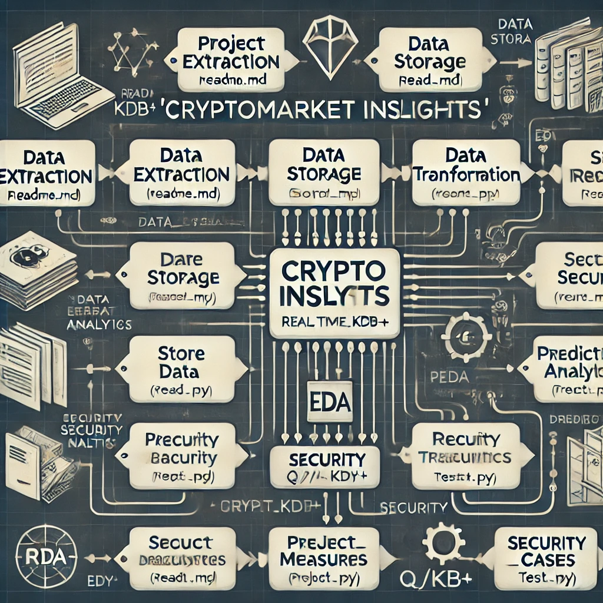

# crypto-data-analysis
Cryptocurrency Market Data Extraction and Examining as kdb+q

## Project Workflow 

crypto_project/
│
├── project_planning/
│   └── README.md
│
├── data_extraction/
│   └── extract_data.py
│
├── data_storage/
│   └── store_data.py
│
├── data_transformation/
│   └── transform_data.py
│
├── eda/
│   └── eda_analysis.py
│
├── predictive_analytics/
│   └── predict.py
│
├── security/
│   └── security_measures.py
│
├── documentation/
│   └── project_report.md
│
└── testing/
    └── test_cases.py

Project Extraction
Data Storage
Data Extraction
Data Storage
Data Tranformation
Data Record
Data Analytics
Dare Storage
Store Data
Prescurity security
Seduct Draguintes
Project Measures
Security Cases
CRYPTO INSIGHTS
EDA
Security Q/I- KDB+
Security Trecuintics
Predict Analytics
PEDA
DREDIBO
